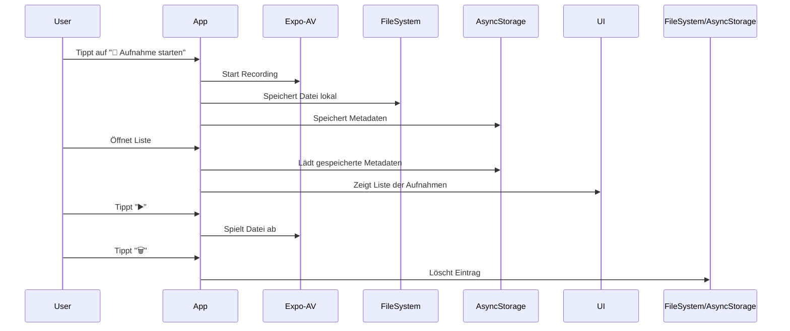

# 🧾 Product Requirements Document (PRD)
## Projektname: Audio Memo App – Phase 1 (Lokaler Audio CRUD Browser)
**Version:** v1.0  
**Ziel:** Vollständig offline funktionierende iOS-App zur Audioaufnahme und -verwaltung  
**Verantwortlicher:** Codex Software Agent  

---

## 🎯 1. Projektziel
Entwickle eine **mobile App (iOS-first)**, die es Nutzern erlaubt, **Audio-Memos lokal aufzunehmen, zu speichern, anzuhören, umzubenennen und zu löschen** – vollständig **offline** und **persistiert auf dem Gerät**.  
Diese Version (**Phase 1**) arbeitet **ohne Server oder Cloud-Sync**.  
Sie dient als stabile Basis für **Phase 2 (REST-Synchronisation)**.

---

## 🧠 2. Technologische Vorgaben

### Frontend / App
- **Framework:** React Native mit **Expo SDK (neueste Version)**
- **Sprache:** TypeScript
- **UI-System:**  
  - **NativeWind** (Tailwind-kompatibel für React Native)  
  - Komponenten inspiriert von **shadcn/ui**  
  - Einheitliches Designsystem (abgerundete Ecken, Schatten, helle Flächen)
- **Audioaufnahme & Wiedergabe:** `expo-av`
- **Dateiverwaltung (lokal):** `expo-file-system`
- **Persistente Metadaten (Storage):** `@react-native-async-storage/async-storage`
- **Navigation (falls benötigt):** `@react-navigation/native`
- **Zielplattform:** iOS (iPhone, Expo Go und Simulator)

### Architekturprinzipien
- Modular aufgebaut (Komponenten, Utils, Hooks)
- Kein Overengineering (kein Redux)
- Offline-first
- Einfach wartbar & erweiterbar für Sync-Phase

---

## 🧱 3. Funktionsumfang (MVP-Umfang Phase 1)

### 🎙 Create
- Mikrofonberechtigung abfragen
- Aufnahme mit hoher Qualität (`Audio.RECORDING_OPTIONS_PRESET_HIGH_QUALITY`)
- Speichern im App-Dateisystem (`FileSystem.documentDirectory`)
- Automatisch Metadaten erzeugen:  
  `{ id, name, uri, createdAt, duration }`
- Metadaten persistieren in AsyncStorage

### 📜 Read
- Beim App-Start: Lade alle gespeicherten Metadaten
- Validierung: Überprüfe, ob die Dateien im Dateisystem existieren
- Zeige Liste mit Name, Datum, Dauer
- Play-Button für Wiedergabe (`Audio.Sound`)

### ✏️ Update
- Name der Aufnahme änderbar (Eingabefeld oder Modal)
- Änderungen persistent speichern (AsyncStorage aktualisieren)

### 🗑️ Delete
- Aufnahme löschen (Datei + Metadaten entfernen)
- Soft-Feedback im UI (z. B. Toast oder kurze Animation)

### 📂 Persistenz
- Alle Daten bleiben nach App-Neustart erhalten
- AsyncStorage hält JSON-Array aller Aufnahmen:
  ```json
  [
    {
      "id": "1728591823",
      "uri": "file:///data/audio/rec-1728591823.m4a",
      "name": "Idee am Morgen",
      "createdAt": "2025-10-13T08:41:00Z",
      "duration": 23.5
    }
  ]
  ```

---

## 🧩 4. App-Struktur (Dateiarchitektur)

```
audio-memo-app/
│
├── App.tsx
├── components/
│   ├── RecordingItem.tsx       ← Anzeige eines Audios mit Play/Delete/Edit
│   └── RecordButton.tsx        ← Floating Action Button für Aufnahme
│
├── hooks/
│   └── useRecordings.ts        ← CRUD + Persistenz-Logik (AsyncStorage + FileSystem)
│
├── utils/
│   ├── audio.ts                ← Aufnahme- & Wiedergabefunktionen
│   └── fileHelpers.ts          ← Dateioperationen
│
├── styles/
│   └── tailwind.config.js      ← NativeWind Setup
│
├── package.json
└── app.json
```

---

## 🎨 5. UI/UX-Richtlinien

### Designstil
- Minimalistisch, clean, inspiriert von **shadcn/ui**
- Farben: Grau-Weiß-Blau, klare Kontraste
- Runde Buttons, sanfte Schatten
- Fokus auf Accessibility und Einfachheit

### Hauptbildschirm
- Titel: **“Meine Aufnahmen”**
- Liste aller gespeicherten Audios
- Jeder Eintrag:
  - Titel
  - Erstelldatum
  - [▶️ Play] [✏️ Rename] [🗑️ Delete]
- Floating Button unten rechts: 🎤 Start/Stop Aufnahme

### Beispiel (visuelles Layout)
```
------------------------------------
| Meine Aufnahmen                  |
|----------------------------------|
| 💬 Idee am Morgen   ▶️  ✏️  🗑️   |
| 🎵 Einkaufsliste     ▶️  ✏️  🗑️   |
|----------------------------------|
|          [ 🎤  Aufnahme ]         |
------------------------------------
```

---

## 🔄 6. Lokaler Datenfluss



---

## 🔐 7. Persistenz und Offline-Fähigkeit
- Alle Operationen finden lokal auf dem Gerät statt.  
- Keine Internetverbindung notwendig.  
- AsyncStorage dient als dauerhafter Datenspeicher.  
- Beim App-Start werden Metadaten geladen und im Zustand (`useRecordings`) gehalten.

---

## 🧩 8. Erweiterbarkeit (Phase 2–3 Roadmap)

| Phase | Feature | Technologie |
|--------|----------|-------------|
| 2 | Synchronisation mit REST-API | Node.js + Express + Multer |
| 3 | Sharing & Export | `expo-sharing` oder `react-native-share` |
| 4 | Transkription (lokal oder Cloud) | Whisper / Vosk / OpenAI API |
| 5 | Authentifizierung | JWT oder OAuth2 |

---

## 🧠 9. Deliverables

**Muss geliefert werden:**
- Vollständig lauffähige iOS-App (Expo Go oder Simulator)
- Quellcode in TypeScript, kommentiert
- README mit Setup-Anleitung:
  - `npm install`
  - `npx expo start`
- Dokumentierte `useRecordings`-Hook-Logik
- 3 Beispielaufnahmen getestet (CRUD verifiziert)

---

## 📦 10. Test & Validierung

- Unit-Test der CRUD-Funktionen (optional mit Jest)
- Manuelle Tests auf iOS:
  - Aufnahme starten/stoppen
  - Datei persistent vorhanden nach Neustart
  - Wiedergabe funktioniert
  - Umbenennen und Löschen korrekt reflektiert
- Performance: Keine merkliche UI-Lags beim Listenrendering (< 50 Aufnahmen)

---

## 💬 11. Auftrag an den Codex Software Agent

> **Auftrag:**  
> Implementiere das oben spezifizierte System als vollständige React Native (Expo) App.  
> 
> **Ziele:**  
> - Alle Audio-Dateien werden **lokal** gespeichert, gelesen, aktualisiert und gelöscht.  
> - Der Code ist **TypeScript-basiert**, modular und sauber dokumentiert.  
> - UI-Design folgt dem **shadcn/ui-Stil** unter Verwendung von **NativeWind**.  
> - Das System läuft offline auf einem **iOS-Gerät (oder im Expo-Simulator)**.  
> 
> Nach Abschluss: Bereitstellung des lauffähigen Projekts + README.
