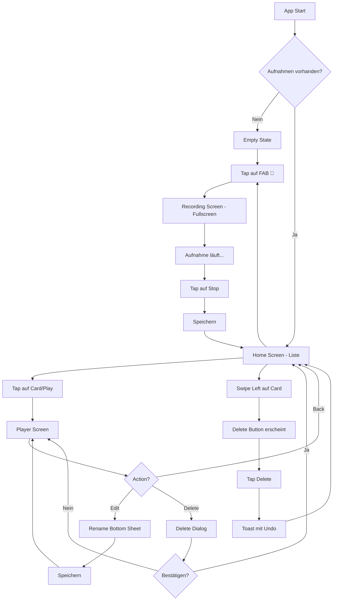

# 🎨 UI/UX Konzept - Audio Memo App
**Version:** v1.0
**Projekt:** Audio Memo App - Phase 1
**Datum:** 13. Oktober 2025

---

## 📱 Screen-Architektur

Die App besteht aus **3 Hauptscreens** + **2 Overlays**:

1. **Home Screen** - Liste aller Aufnahmen
2. **Recording Screen** - Fullscreen während Aufnahme (Modal)
3. **Player Screen** - Dedizierter Playback-Screen
4. **Rename Dialog** - Bottom Sheet Overlay
5. **Delete Confirmation** - Alert Dialog + Swipe-to-Delete

---

## 🏠 1. Home Screen - Aufnahmen-Liste

### Layout-Struktur

```
┌─────────────────────────────┐
│  Meine Aufnahmen        ⚙️  │ ← Header (Settings Icon rechts)
├─────────────────────────────┤
│                             │
│  📂 12 Aufnahmen            │ ← Metainfo
│                             │
├─────────────────────────────┤
│                             │
│ ┌─────────────────────────┐ │
│ │ 🎙️ Morgen-Idee         │ │ ← Card mit Shadow
│ │ 13. Okt 2025 • 00:23   │ │   Name + Datum + Dauer
│ │                        │ │
│ │ ▶️  ✏️  🗑️             │ │ ← Action Buttons
│ └─────────────────────────┘ │
│                             │
│ ┌─────────────────────────┐ │
│ │ 🎙️ Einkaufsliste       │ │
│ │ 12. Okt 2025 • 01:45   │ │
│ │                        │ │
│ │ ▶️  ✏️  🗑️             │ │
│ └─────────────────────────┘ │
│                             │
│ ┌─────────────────────────┐ │
│ │ 🎙️ Meeting Notizen     │ │
│ │ 11. Okt 2025 • 12:34   │ │
│ │                        │ │
│ │ ▶️  ✏️  🗑️             │ │
│ └─────────────────────────┘ │
│                             │
│                             │
│                      ┌────┐ │
│                      │ 🎤 │ │ ← Floating Action Button
│                      └────┘ │   (immer sichtbar)
└─────────────────────────────┘
```

### Empty State (keine Aufnahmen)

```
┌─────────────────────────────┐
│  Meine Aufnahmen        ⚙️  │
├─────────────────────────────┤
│                             │
│                             │
│                             │
│         🎙️                  │
│                             │
│      Welcome!               │ ← Großer Titel
│                             │
│   Starte deine erste        │
│      Aufnahme               │
│                             │
│      ┌─────────────┐        │
│      │  🎤 Start   │        │ ← Großer Button
│      └─────────────┘        │
│                             │
│                             │
└─────────────────────────────┘
```

### Interaktionen

- **Tap auf Card** → Öffnet Player Screen
- **Tap auf ▶️** → Öffnet Player Screen (direkt Play)
- **Tap auf ✏️** → Öffnet Rename Bottom Sheet
- **Tap auf 🗑️** → Zeigt Delete Confirmation Dialog
- **Swipe Left auf Card** → Zeigt Delete-Button (Swipe-to-Delete)
- **Tap auf 🎤 FAB** → Öffnet Recording Screen (Fullscreen Modal)

### Komponenten-Details

**Card:**
- Background: `#FFFFFF`
- Border Radius: `12px`
- Shadow: `0 2px 8px rgba(0,0,0,0.1)`
- Padding: `16px`
- Margin: `12px horizontal, 8px vertical`

**Action Buttons:**
- Size: `44x44px` (iOS Touch Target)
- Color: `#64748B` (Grau)
- Active State: `#3B82F6` (Blau)

**FAB (Floating Action Button):**
- Size: `64x64px`
- Background: `#3B82F6` (Blau)
- Position: `bottom: 24px, right: 24px`
- Shadow: `0 4px 12px rgba(59, 130, 246, 0.4)`
- Icon: 🎤 (Weiß)

---

## 🎙️ 2. Recording Screen - Fullscreen Modal

### Layout-Struktur

```
┌─────────────────────────────┐
│  ✕                          │ ← Close Button (oben links)
├─────────────────────────────┤
│                             │
│                             │
│         ● REC               │ ← Recording Indicator
│                             │   (pulsierend)
│                             │
│       ┌───────────┐         │
│       │           │         │
│       │  00:23    │         │ ← Live Timer
│       │           │         │   (große Schrift)
│       └───────────┘         │
│                             │
│                             │
│      ▓▓░░▓▓▓░░▓░▓▓         │ ← Wellenform Visualizer
│      ▓▓░░▓▓▓░░▓░▓▓         │   (optional, Phase 2)
│                             │
│                             │
│                             │
│                             │
│      ┌─────────────┐        │
│      │             │        │
│      │   ⏹ Stopp  │        │ ← Stop Button (groß)
│      │             │        │
│      └─────────────┘        │
│                             │
│   Zum Speichern stoppen     │ ← Helper Text
│                             │
└─────────────────────────────┘
```

### Interaktionen

- **Tap auf ✕** → Zeigt Confirmation ("Aufnahme verwerfen?")
- **Tap auf ⏹ Stopp** → Speichert Aufnahme, schließt Modal, kehrt zu Home zurück

### Animation

- **Modal öffnet:** Slide-up Animation (300ms)
- **Recording Indicator:** Pulsiert (1s Loop)
- **Timer:** Zählt hoch in Echtzeit (00:00 → MM:SS)

### Komponenten-Details

**Background:** `#F8FAFC` (Hell-Grau)

**Timer:**
- Font Size: `48px`
- Font Weight: `Bold`
- Color: `#1E293B` (Dunkel)

**Stop Button:**
- Size: `120x60px`
- Background: `#EF4444` (Rot)
- Border Radius: `12px`
- Icon + Text: Weiß

**Recording Indicator:**
- Size: `16px` Kreis
- Color: `#EF4444` (Rot)
- Animation: Scale 1.0 ↔ 1.2 (pulsierend)

---

## 🎵 3. Player Screen - Dedizierter Playback Screen

### Layout-Struktur

```
┌─────────────────────────────┐
│  ←                          │ ← Back Button
├─────────────────────────────┤
│                             │
│                             │
│       ┌───────────┐         │
│       │           │         │
│       │    🎙️     │         │ ← Großes Icon
│       │           │         │
│       └───────────┘         │
│                             │
│      Morgen-Idee            │ ← Titel (Fett, 24px)
│      13. Oktober 2025       │ ← Datum
│                             │
│                             │
│  ━━━━━━━━●━━━━━━━━━━━━━    │ ← Seekbar (verschiebbar)
│  00:08           00:23      │ ← Current / Total Time
│                             │
│                             │
│       ⏮  ⏸  ⏭              │ ← Player Controls
│                             │   (Previous, Pause, Next)
│                             │
│                             │
│      ✏️              🗑️      │ ← Edit & Delete Icons
│                             │
└─────────────────────────────┘
```

### Interaktionen

- **Tap auf ←** → Zurück zu Home Screen
- **Drag Seekbar** → Spult vor/zurück
- **Tap auf ⏸** → Pause (wird zu ▶️)
- **Tap auf ⏮** → Springt 15s zurück
- **Tap auf ⏭** → Springt 15s vor
- **Tap auf ✏️** → Öffnet Rename Bottom Sheet
- **Tap auf 🗑️** → Zeigt Delete Confirmation

### Alternative Controls (Phase 2)

```
│    🔄 1.0x   ⭐   📤         │ ← Speed, Favorite, Share
```

### Komponenten-Details

**Seekbar:**
- Height: `4px`
- Progress Color: `#3B82F6` (Blau)
- Background: `#E2E8F0` (Hell-Grau)
- Thumb: `16px` Kreis (Weiß mit Shadow)

**Control Buttons:**
- Size: `56x56px`
- Center Button (Pause): `72x72px` (größer)
- Color: `#3B82F6` (Blau)

---

## ✏️ 4. Rename Dialog - Bottom Sheet

### Layout-Struktur

```
┌─────────────────────────────┐
│                             │
│  ▂▂▂▂▂▂                     │ ← Drag Handle
│                             │
│  Umbenennen                 │ ← Titel
│                             │
│  ┌─────────────────────┐   │
│  │ Morgen-Idee         │   │ ← Text Input (fokussiert)
│  └─────────────────────┘   │
│                             │
│  [Abbrechen]    [Speichern] │ ← Buttons
│                             │
└─────────────────────────────┘
```

### Interaktionen

- **Swipe Down** → Schließt Bottom Sheet
- **Tap außerhalb** → Schließt Bottom Sheet
- **Tap auf Abbrechen** → Schließt ohne zu speichern
- **Tap auf Speichern** → Speichert neuen Namen, schließt Sheet

### Animation

- **Öffnet:** Slide-up von unten (250ms)
- **Keyboard:** Push-up Animation
- **Schließt:** Slide-down (200ms)

### Komponenten-Details

**Bottom Sheet:**
- Border Radius: `24px 24px 0 0`
- Background: `#FFFFFF`
- Shadow: `0 -4px 12px rgba(0,0,0,0.1)`
- Min Height: `240px`

**Text Input:**
- Border: `1px solid #E2E8F0`
- Focus Border: `2px solid #3B82F6`
- Padding: `12px`
- Font Size: `16px`

---

## 🗑️ 5. Delete Confirmation

### Variante A: Alert Dialog

```
┌─────────────────────────────┐
│                             │
│  ╔═══════════════════════╗ │
│  ║  ⚠️ Aufnahme löschen? ║ │
│  ║                       ║ │
│  ║  "Morgen-Idee"        ║ │
│  ║  wirklich löschen?    ║ │
│  ║                       ║ │
│  ║  Diese Aktion kann    ║ │
│  ║  nicht rückgängig     ║ │
│  ║  gemacht werden.      ║ │
│  ║                       ║ │
│  ║ [Abbrechen] [Löschen] ║ │
│  ╚═══════════════════════╝ │
│                             │
└─────────────────────────────┘
```

### Variante B: Swipe-to-Delete

```
┌─────────────────────────────┐
│ ┌─────────────────────────┐ │
│ │ 🎙️ Einkaufsliste       │ │ ← Swipe nach links
│ │ 12. Okt • 01:45    [🗑]│ │   zeigt Delete-Button
│ └─────────────────────────┘ │
│                             │
│  ┌─────────────────────┐   │
│  │ ✓ Gelöscht [Rückgängig]│ │ ← Toast (3 Sekunden)
│  └─────────────────────┘   │
│                             │
└─────────────────────────────┘
```

### Interaktionen

**Dialog:**
- **Tap auf Abbrechen** → Schließt Dialog
- **Tap auf Löschen** → Löscht Aufnahme, zeigt Toast "Gelöscht"

**Swipe:**
- **Swipe Left** → Zeigt Delete-Button
- **Tap auf 🗑** → Sofortiges Löschen mit Undo-Toast
- **Tap auf Rückgängig** → Stellt Aufnahme wieder her (3s Zeit)

---

## 🎨 Design System

### Farbpalette

```
Primary:       #3B82F6  (Blau)
Primary Dark:  #2563EB
Primary Light: #60A5FA

Secondary:     #64748B  (Grau)
Success:       #10B981  (Grün)
Danger:        #EF4444  (Rot)
Warning:       #F59E0B  (Orange)

Background:    #F8FAFC  (Hell-Grau)
Surface:       #FFFFFF  (Weiß)
Border:        #E2E8F0

Text Primary:  #1E293B  (Dunkel)
Text Secondary: #64748B (Grau)
Text Disabled: #CBD5E1  (Hell-Grau)
```

### Typography

```
H1 (Screen Title):  24px, Bold, #1E293B
H2 (Card Title):    18px, Semi-Bold, #1E293B
Body:               16px, Regular, #475569
Caption:            14px, Regular, #64748B
Timer:              48px, Bold, #1E293B
Button:             16px, Semi-Bold, #FFFFFF
```

### Spacing System

```
xs:   4px
sm:   8px
md:   12px
lg:   16px
xl:   24px
2xl:  32px
3xl:  48px
```

### Border Radius

```
Small:  8px  (Buttons)
Medium: 12px (Cards)
Large:  24px (Bottom Sheets)
Round:  999px (FAB, Avatars)
```

### Shadows

```
Card:  0 2px 8px rgba(0, 0, 0, 0.1)
FAB:   0 4px 12px rgba(59, 130, 246, 0.4)
Modal: 0 8px 24px rgba(0, 0, 0, 0.15)
```

---

## 📐 Layout-Grid

- **Safe Area:** Respektiere iOS/Android Safe Area (Notch, Statusbar)
- **Horizontal Padding:** `16px` (lg)
- **Vertical Spacing:** `12px` (md) zwischen Cards
- **Touch Targets:** Minimum `44x44px` (iOS HIG)

---

## 🔄 Animationen & Transitions

### Screen Transitions

```
Home ↔ Player:     Slide (horizontal, 300ms)
Home → Recording:  Modal Slide-up (300ms)
Recording → Home:  Modal Slide-down (250ms)
Bottom Sheet:      Slide-up (250ms)
```

### Micro-Interactions

```
Button Press:      Scale 0.95 (100ms)
Card Tap:          Opacity 0.7 (150ms)
FAB Tap:           Scale 0.9 → 1.1 → 1.0 (200ms)
Recording Pulse:   Scale 1.0 ↔ 1.2 (1000ms loop)
Swipe Reveal:      Elastic (300ms)
Toast:             Fade-in + Slide-up (200ms)
```

### Loading States

```
Recording Start:   Fade-in + Scale (200ms)
File Loading:      Spinner (Indeterminate)
Delete:            Fade-out + Scale-down (300ms)
```

---

## 📱 Platform-Spezifische Anpassungen

### iOS

- **Status Bar:** Light Content (weiße Icons)
- **Navigation:** Swipe-back Gesture aktiv
- **Haptics:** Vibration bei Recording Start/Stop
- **Alert Style:** iOS Native Alert Dialog

### Android

- **Status Bar:** Transparent mit dunklen Icons
- **Navigation:** Hardware Back Button Support
- **FAB:** Material Design Elevation
- **Alert Style:** Material Dialog

---

## 🧪 Edge Cases & Error States

### Fehlermeldungen

**Mikrofon-Berechtigung verweigert:**
```
┌─────────────────────────────┐
│  ⚠️ Mikrofon-Zugriff        │
│                             │
│  Bitte erlaube in den       │
│  Einstellungen den Zugriff  │
│  auf das Mikrofon.          │
│                             │
│  [Einstellungen öffnen]     │
└─────────────────────────────┘
```

**Speicher voll:**
```
┌─────────────────────────────┐
│  ⚠️ Speicher voll           │
│                             │
│  Nicht genügend Speicher-   │
│  platz für neue Aufnahmen.  │
│                             │
│  [OK]                       │
└─────────────────────────────┘
```

**Audiodatei nicht gefunden:**
```
Toast: "⚠️ Datei nicht gefunden"
(wird automatisch aus Liste entfernt)
```

### Offline-Indikator

Da die App komplett offline funktioniert, **kein** Netzwerk-Status-Banner nötig.

---

## ✅ Checkliste für Implementation

- [ ] Home Screen mit Empty State
- [ ] Recording Screen (Fullscreen Modal)
- [ ] Player Screen (dediziert)
- [ ] Rename Bottom Sheet
- [ ] Delete Confirmation Dialog
- [ ] Swipe-to-Delete auf Cards
- [ ] FAB mit Recording-Start
- [ ] Seekbar mit Drag-Funktionalität
- [ ] Toast-Notifications
- [ ] Haptic Feedback (iOS/Android)
- [ ] Safe Area Handling
- [ ] Dark Mode Support (Phase 2)

---

## 📊 User Flow Diagram



---

## 🎯 Nächste Schritte

1. **Setup:** React Native Expo Projekt initialisieren
2. **Dependencies:** NativeWind, expo-av, AsyncStorage installieren
3. **Structure:** Ordnerstruktur gemäß PRD anlegen
4. **Components:** Komponenten-Skelette erstellen
5. **Navigation:** React Navigation Setup (Stack Navigator)
6. **Styling:** NativeWind konfigurieren + Design Tokens
7. **Implementation:** Screen für Screen umsetzen

---

**Bereit für Phase 1 Implementation! 🚀**
